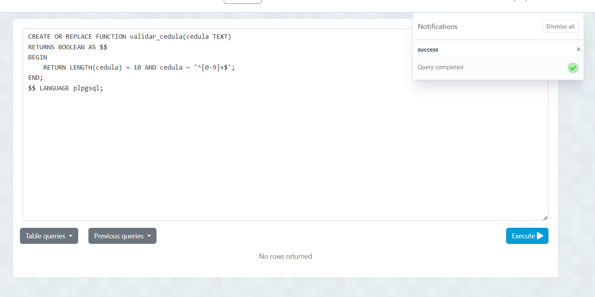
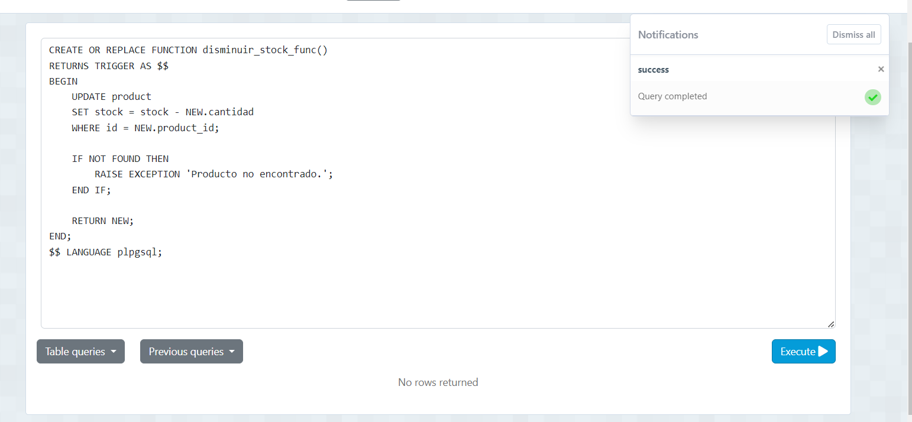
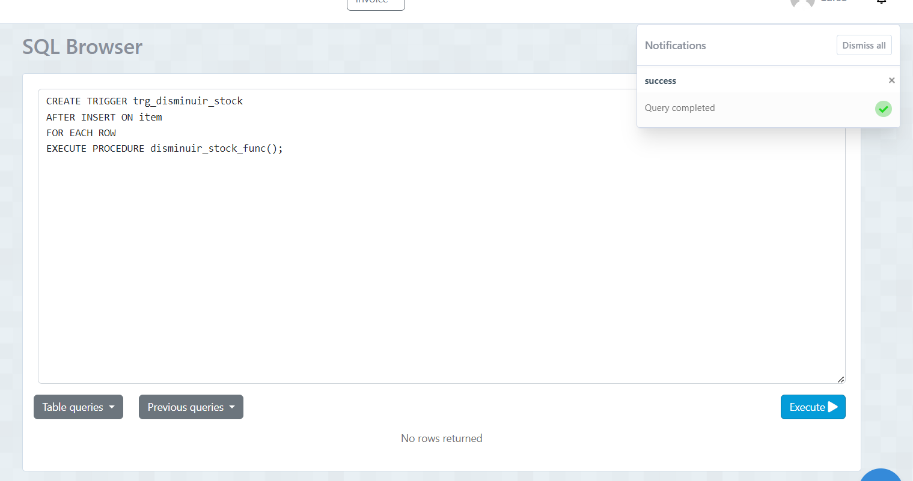
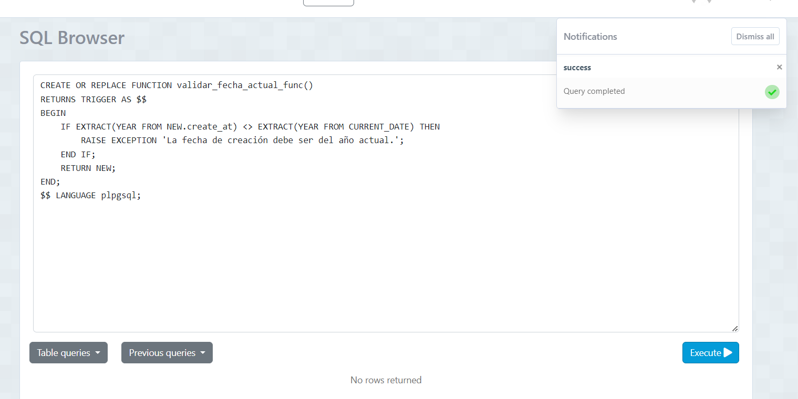
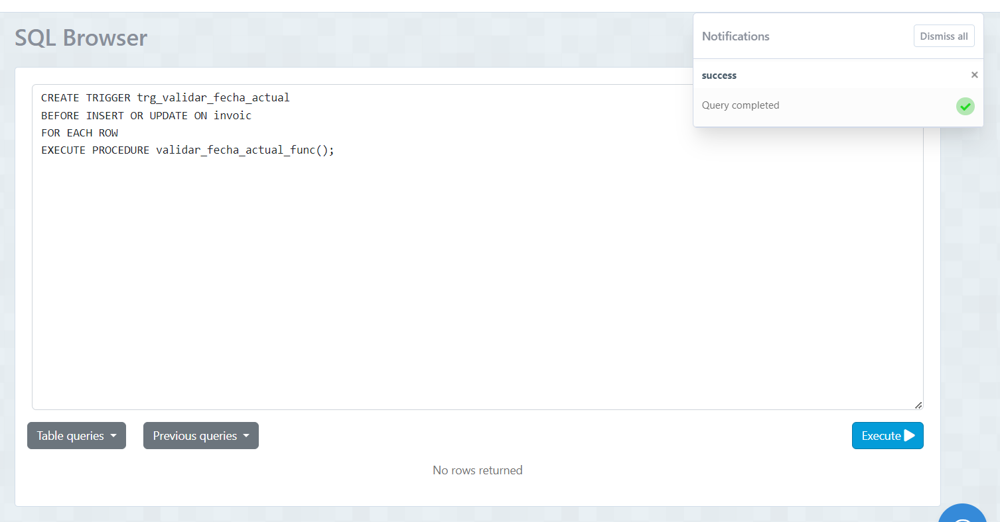
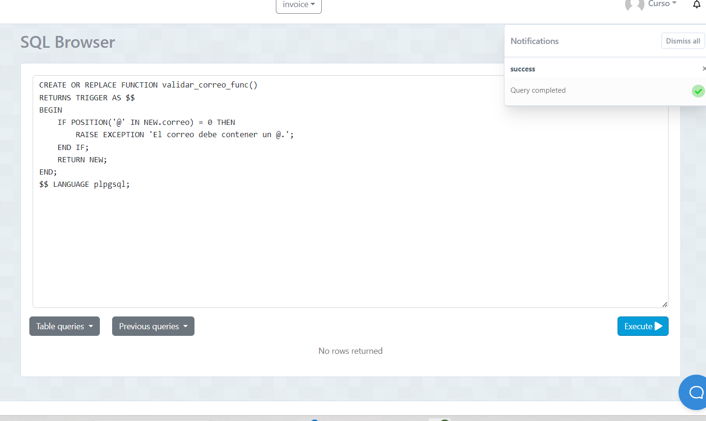
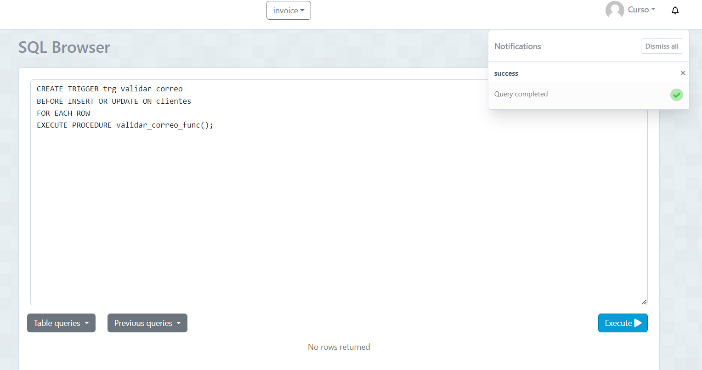

## Desarrollar los siguientes ejercicios usando subconsultas.

## DB INVOICE
1.-Crear un función y un trigger para validar que el numero de cedula del cliente tenga 10 números (no letras) en la tabla cliente.

```
CREATE OR REPLACE FUNCTION validar_cedula_func()
RETURNS TRIGGER AS $$
BEGIN
    IF LENGTH(NEW.cedula) <> 10 OR NEW.cedula !~ '^[0-9]+$' THEN
        RAISE EXCEPTION 'La cédula debe tener 10 números.';
    END IF;
    RETURN NEW;
END;
$$ LANGUAGE plpgsql;

```
```
CREATE TRIGGER trg_validar_cedula
BEFORE INSERT OR UPDATE ON cliente
FOR EACH ROW
EXECUTE PROCEDURE validar_cedula_func();

```
- captura

2.-Crear un función y un trigger para que cada vez que se inserte un nuevo registro en la tabla item se disminuya el stock de la tabla product.

```
CREATE OR REPLACE FUNCTION disminuir_stock_func()
RETURNS TRIGGER AS $$
BEGIN
    UPDATE producto
    SET stock = stock - NEW.cantidad
    WHERE id = NEW.product_id;

    IF NOT FOUND THEN
        RAISE EXCEPTION 'Producto no encontrado.';
    END IF;

    RETURN NEW;
END;
$$ LANGUAGE plpgsql;
```
```
CREATE TRIGGER trg_disminuir_stock
AFTER INSERT ON item
FOR EACH ROW
EXECUTE PROCEDURE disminuir_stock_func();

```
- captura




3.-Crear un función y un trigger para la tabla invoice donde valide que el campo create_at sea del año actual (fecha sistema).

```
CREATE OR REPLACE FUNCTION validar_fecha_actual_func()
RETURNS TRIGGER AS $$
BEGIN
    IF EXTRACT(YEAR FROM NEW.create_at) <> EXTRACT(YEAR FROM CURRENT_DATE) THEN
        RAISE EXCEPTION 'La fecha de creación debe ser del año actual.';
    END IF;
    RETURN NEW;
END;
$$ LANGUAGE plpgsql;
```
```
CREATE TRIGGER trg_validar_fecha_actual
BEFORE INSERT OR UPDATE ON invoic
FOR EACH ROW
EXECUTE PROCEDURE validar_fecha_actual_func();

```
- captura



    
4.-Crear un función y un trigger para la tabla client y validar que el correo tenga un @.

```
CREATE OR REPLACE FUNCTION validar_correo_func()
RETURNS TRIGGER AS $$
BEGIN
    IF POSITION('@' IN NEW.correo) = 0 THEN
        RAISE EXCEPTION 'El correo debe contener un @.';
    END IF;
    RETURN NEW;
END;
$$ LANGUAGE plpgsql;
```
```
CREATE TRIGGER trg_validar_correo
BEFORE INSERT OR UPDATE ON clientes
FOR EACH ROW
EXECUTE PROCEDURE validar_correo_func();

```
- captura


